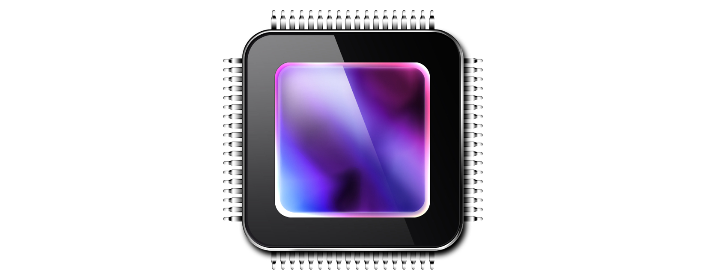
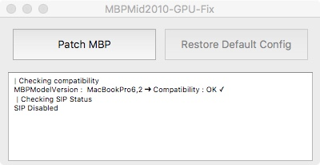

# MBPMid2010_GPUFix

MBPMid2010_GPUFix is an utility program that allows to fix [MacBook Pro (15-inch, Mid 2010) intermittent black screen or loss of video](https://support.apple.com/en-us/HT203554). The algorithm is based on a solution provided by user [fabioroberto](https://forums.macrumors.com/members/fabioroberto.797465/) on [MacRumors forums](https://forums.macrumors.com/threads/gpu-kernel-panic-in-mid-2010-whats-the-best-fix.1890097/#post-23312990).

The utility is based on Qt Framework and only available on OSX.

**APP HAS TO BE RUN AFTER EVERY NEW SOFTWARE UPDATE ON YOUR MAC**

---

## Features
- MacBook Pro version detection
- SIP Status detection
- Patch of `AppleGraphicsPowerManagement.kext` file
- *Coming soon* : Restore of backuped file 

## Compatibility
The app is compatible with macOS `10.10`, `10.11`, `10.12`, `10.13`and `10.14`

## Downloads
Latest version can be downloaded here : 

## [Change Log](CHANGELOG.md)

## Idea/Suggestions
If you have any ideas or suggestion please open an [Issue](https://github.com//julian-poidevin/MBPMid2010_GPUFix/issues)

## [FAQ](FAQ.md)
Please see [FAQ.md](FAQ.md)

## Donations
You can donate for my work via Paypal : [HERE](https://www.paypal.com/cgi-bin/webscr?cmd=_s-xclick&hosted_button_id=VR3QQDC6GMDCQ)

Thanks to all my tippers ! The full list is available here : [Backers.md](Backers.md)

## Disclaimer
- SIP must be disabled at all time
- **The fix will not work when using external screen**
- GPU performance will be lowered a bit

## Credits
- User [fabioroberto](https://forums.macrumors.com/members/fabioroberto.797465/) from [MacRumors forums](https://forums.macrumors.com) for helping me tweaking the application and his kindness
